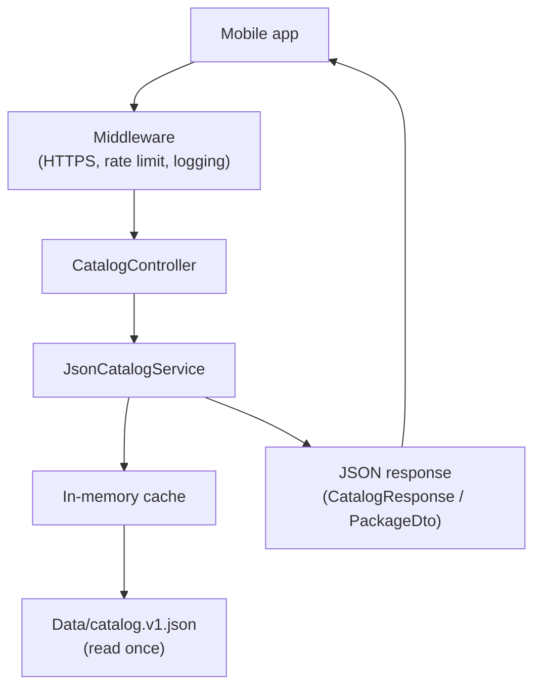
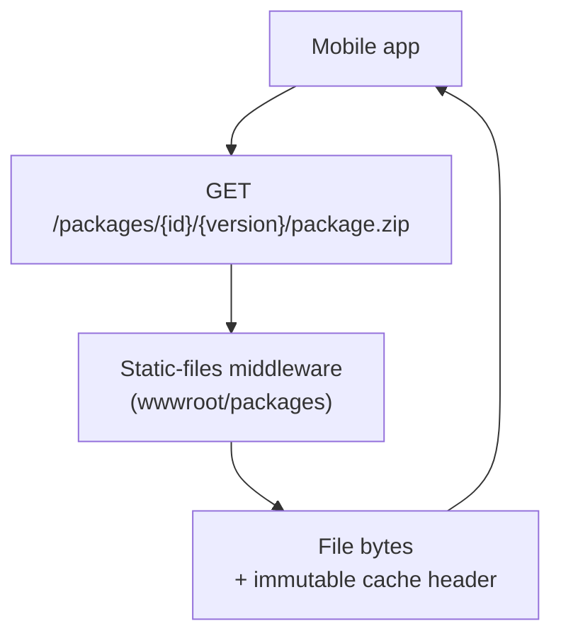

# BibleMemorization.Api

Catalog and content-delivery backend for the **Bible Memorization Companion** mobile app.

This service is intentionally small. In Phase 1 it does two things:

1. Exposes a **read-only catalog API** that tells the app which packages exist and where to download them.
2. **Serves the package artifacts** (`.zip`, `manifest.json`, `.sha256`) as static files over HTTPS.

Everything else — downloads, install, verse study, progress — lives on the mobile client (offline-first). The backend keeps no user data and requires no sign-in in this phase (guest-first).

---

## Tech stack

| Concern | Choice |
| --- | --- |
| Runtime | .NET 10 (`net10.0`) |
| Framework | ASP.NET Core Web API (**controllers**, not minimal APIs) |
| API docs | Native OpenAPI (`Microsoft.AspNetCore.OpenApi`) |
| API explorer | [Scalar](https://scalar.com) UI at `/scalar` (Development only) |
| Catalog source | Static JSON file (`Data/catalog.v1.json`), cached in memory |
| Database | None yet — staged behind `ICatalogService` for a future EF Core + MySQL phase |

The SDK version is pinned in [`../global.json`](../global.json) to `10.0.x`.

---

## Project structure

```text
BibleMemorization.Api/
├─ Program.cs                     # App bootstrap: DI, middleware pipeline, endpoints
├─ appsettings.json               # Base configuration (logging, allowed hosts)
├─ appsettings.Development.json   # Development overrides
├─ BibleMemorization.Api.csproj   # Target framework + NuGet references
│
├─ Controllers/
│  └─ CatalogController.cs        # HTTP layer: maps routes to the catalog service
│
├─ Services/
│  ├─ ICatalogService.cs          # Catalog abstraction (swap JSON → EF/MySQL later)
│  └─ JsonCatalogService.cs       # Reads catalog.v1.json once and caches it
│
├─ Models/
│  ├─ Dtos/
│  │  ├─ CatalogResponse.cs       # { catalogVersion, publishedAt, packages[] }
│  │  ├─ PackageDto.cs            # One catalog item (id, title, urls, checksum, …)
│  │  └─ PriceDto.cs              # { amount, currency } — null for free packages
│  ├─ Enums/
│  │  └─ PackageType.cs           # book | season | audio_addon (serialized as strings)
│  └─ Entities/                   # (empty) reserved for EF entities in a later phase
│
├─ Configuration/
│  └─ CatalogOptions.cs           # Bound to the "Catalog" config section (file path)
│
├─ Data/
│  └─ catalog.v1.json             # Seed catalog (the 5 launch packages)
│
└─ wwwroot/
   └─ packages/                   # Static package artifacts, served by direct link
      └─ {packageId}/{version}/   # Immutable per-version paths
         ├─ manifest.json
         ├─ package.zip
         └─ package.sha256
```

---

## What each part does

### Controllers — the HTTP layer
[`CatalogController`](Controllers/CatalogController.cs) is the only entry point for API calls. It is thin on purpose: it receives the request, calls `ICatalogService`, and shapes the HTTP response (200 with the DTO, or 404 when a package id is unknown). It also sets a short `Cache-Control` header so clients cache the catalog for a few minutes.

### Services — the domain/data layer
[`ICatalogService`](Services/ICatalogService.cs) defines *what* the catalog can do (get all packages, get one by id) without saying *how*. [`JsonCatalogService`](Services/JsonCatalogService.cs) is the Phase 1 implementation: it reads `Data/catalog.v1.json` a single time, caches the result in memory (guarded by a `SemaphoreSlim`), and serves every request from that cache. Because the interface hides the source, a future `EfCatalogService` backed by MySQL can replace it **without touching the controller**.

### Models — the contracts
The `Dtos` are immutable `record` types that define the exact JSON shape the mobile app consumes (serialized in camelCase). `PackageType` is an enum that serializes to explicit strings (`"book"`, `"season"`, `"audio_addon"`).

### Configuration
[`CatalogOptions`](Configuration/CatalogOptions.cs) makes the catalog file path configurable via the `"Catalog"` section, defaulting to `Data/catalog.v1.json`.

### Static artifacts (wwwroot)
The actual downloadable files live under `wwwroot/packages/{id}/{version}/`. They are served as static files by direct link — the URLs in the catalog point straight at them. Paths are **immutable per version**, so artifacts are returned with an aggressive, immutable `Cache-Control` header.

---

## Endpoints

| Method | Route | Description |
| --- | --- | --- |
| `GET` | `/api/v1/catalog` | Full catalog (all packages) |
| `GET` | `/api/v1/catalog/packages/{id}` | One package, or `404` if not found |
| `GET` | `/packages/{id}/{version}/package.zip` | Package artifact (static) |
| `GET` | `/packages/{id}/{version}/manifest.json` | Package manifest (static) |
| `GET` | `/packages/{id}/{version}/package.sha256` | Package checksum (static) |
| `GET` | `/openapi/v1.json` | OpenAPI document (Development) |
| `GET` | `/scalar` | Scalar API explorer (Development) |

---

## Operational features

Configured in [`Program.cs`](Program.cs), all with the built-in framework (no extra packages):

- **HTTPS**: `UseHttpsRedirection` everywhere; `UseHsts` outside Development.
- **HTTP caching**: catalog responses `public, max-age=300`; artifacts `public, max-age=31536000, immutable`.
- **Rate limiting**: fixed window of **100 requests/minute per client IP** (429 when exceeded).
- **Structured logging**: request logging (method, path, status, duration) plus JSON console logs outside Development, each carrying the request `TraceId`.

---

## Running locally

From the `backend/` folder:

```bash
dotnet run --project BibleMemorization.Api
```

Then open the Scalar explorer to try the API:

- Scalar UI: `https://localhost:7131/scalar`
- Catalog: `https://localhost:7131/api/v1/catalog`

> Note: this project targets .NET 10. If `dotnet --version` shows an older SDK, make sure the .NET 10 SDK is on your `PATH` (see `../global.json`).

---

## Configuration reference

`appsettings.json` (and environment-specific overrides) may set:

```json
{
  "Catalog": {
    "FilePath": "Data/catalog.v1.json"
  }
}
```

If the `Catalog` section is omitted, `CatalogOptions` falls back to `Data/catalog.v1.json`.

---

## Roadmap (not in Phase 1)

- **Entitlements & accounts** (`GET /api/v1/entitlements`, `GET /api/v1/users/me`) for paid audio.
- **EF Core + MySQL** implementation of `ICatalogService` when a database is needed.
- **CDN** in front of the static artifacts if traffic grows.

---

## Request flow

The service handles two independent flows. They are shown separately for clarity.

### Flow A — Catalog request

The app asks *which packages exist*. The request goes through the middleware, into the
`CatalogController`, which delegates to the service. The service reads the JSON file only on
the first call and serves every later request from its in-memory cache.



### Flow B — Artifact download

Using the `artifactUrl` it received in Flow A, the app downloads the package file **directly
from static hosting**. No controller is involved — the static-files middleware serves the
bytes with an immutable cache header.


