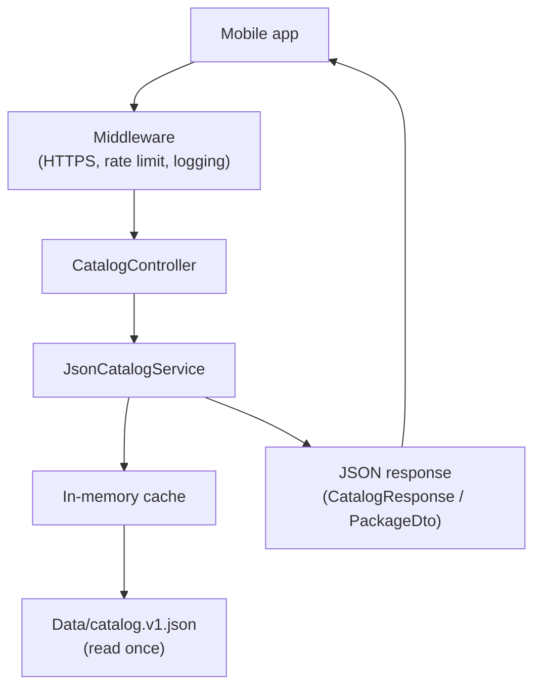
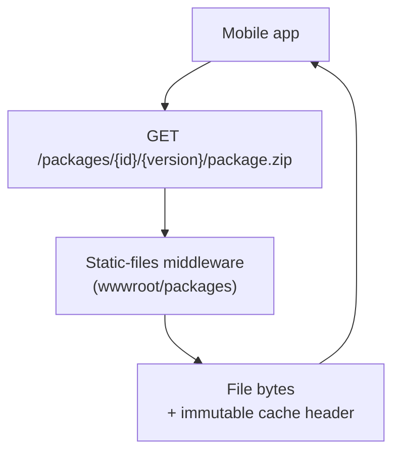

# Backend — Bible Memorization Companion

Backend for the **Bible Memorization Companion** mobile app. It contains three parts:

| Folder | What it is |
| --- | --- |
| [`BibleMemorization.Api/`](BibleMemorization.Api) | The ASP.NET Core Web API (catalog + artifact serving) |
| [`content/`](content) | Authoring sources and the content pipeline ([its own README](content/README.md)) |
| [`tools/ContentTool/`](tools/ContentTool) | C# tool that turns content sources into package artifacts |

The API is intentionally small. In Phase 1 it does two things:

1. Exposes a **read-only catalog API** that tells the app which packages exist and where to download them.
2. **Serves the package artifacts** (`.zip`, `manifest.json`, `.sha256`) as static files over HTTPS.

Everything else — downloads, install, verse study, progress — lives on the mobile client (offline-first). The backend keeps no user data and requires no sign-in in this phase (guest-first).

The SDK version is pinned in [`global.json`](global.json) to `10.0.x`; the solution is `BibleMemorization.Api.slnx`.

---

## Backend layout

```text
backend/
├─ global.json                     # Pins the .NET SDK to 10.0.x
├─ BibleMemorization.Api.slnx       # Solution (API + tests + ContentTool)
│
├─ BibleMemorization.Api/           # The Web API (see "The API" below)
├─ BibleMemorization.Api.Tests/     # Contract tests for the catalog payloads
│
├─ content/                         # Content authoring — see content/README.md
│  └─ {packageId}/
│     ├─ source.txt                 # Plain-text source for a package
│     └─ content/                   # Generated files (index, chapters, sections)
│
└─ tools/
   └─ ContentTool/                  # C# generator: source.txt -> content -> zip artifact
```

## Content & tooling

New books and package artifacts are **not hand-written** — they are produced by a tool from a
plain-text source. The full process (source format, parsing, packaging, checksums) and a
step-by-step **"Adding a new book"** recipe live in **[`content/README.md`](content/README.md)**.

In short:

```bash
# from backend/  — regenerate a package's content + artifact
dotnet run --project tools/ContentTool -- build cb-daniel-7-12
dotnet run --project tools/ContentTool -- build all
```

---

## The API

### Tech stack

| Concern | Choice |
| --- | --- |
| Runtime | .NET 10 (`net10.0`) |
| Framework | ASP.NET Core Web API (**controllers**, not minimal APIs) |
| API docs | Native OpenAPI (`Microsoft.AspNetCore.OpenApi`) |
| API explorer | [Scalar](https://scalar.com) UI at `/scalar` (Development only) |
| Catalog source | Static JSON file (`Data/catalog.v1.json`), cached in memory |
| Database | None yet — staged behind `ICatalogService` for a future EF Core + MySQL phase |

### Project structure

```text
BibleMemorization.Api/
├─ Program.cs                     # App bootstrap: DI, middleware pipeline, endpoints
├─ appsettings.json               # Base configuration (logging, allowed hosts)
├─ appsettings.Development.json   # Development overrides
├─ BibleMemorization.Api.csproj   # Target framework + NuGet references
│
├─ Controllers/
│  └─ CatalogController.cs        # HTTP layer: maps routes to the catalog service
│
├─ Services/
│  ├─ ICatalogService.cs          # Catalog abstraction (swap JSON → EF/MySQL later)
│  └─ JsonCatalogService.cs       # Reads catalog.v1.json once and caches it
│
├─ Models/
│  ├─ Dtos/
│  │  ├─ CatalogResponse.cs       # { catalogVersion, publishedAt, packages[] }
│  │  ├─ PackageDto.cs            # One catalog item (id, title, urls, checksum, …)
│  │  └─ PriceDto.cs              # { amount, currency } — null for free packages
│  ├─ Enums/
│  │  └─ PackageType.cs           # book | season | audio_addon (serialized as strings)
│  └─ Entities/                   # (empty) reserved for EF entities in a later phase
│
├─ Configuration/
│  └─ CatalogOptions.cs           # Bound to the "Catalog" config section (file path)
│
├─ Data/
│  └─ catalog.v1.json             # Catalog served by the API (the published packages)
│
└─ wwwroot/
   └─ packages/                   # Static package artifacts, served by direct link
      └─ {packageId}/{version}/   # Immutable per-version paths
         ├─ manifest.json
         ├─ package.zip
         └─ package.sha256
```

### What each part does

#### Controllers — the HTTP layer
[`CatalogController`](BibleMemorization.Api/Controllers/CatalogController.cs) is the only entry point for API calls. It is thin on purpose: it receives the request, calls `ICatalogService`, and shapes the HTTP response (200 with the DTO, or 404 when a package id is unknown). It also sets a short `Cache-Control` header so clients cache the catalog for a few minutes.

#### Services — the domain/data layer
[`ICatalogService`](BibleMemorization.Api/Services/ICatalogService.cs) defines *what* the catalog can do (get all packages, get one by id) without saying *how*. [`JsonCatalogService`](BibleMemorization.Api/Services/JsonCatalogService.cs) is the Phase 1 implementation: it reads `Data/catalog.v1.json` a single time, caches the result in memory (guarded by a `SemaphoreSlim`), and serves every request from that cache. Because the interface hides the source, a future `EfCatalogService` backed by MySQL can replace it **without touching the controller**.

#### Models — the contracts
The `Dtos` are immutable `record` types that define the exact JSON shape the mobile app consumes (serialized in camelCase). `PackageType` is an enum that serializes to explicit strings (`"book"`, `"season"`, `"audio_addon"`).

#### Configuration
[`CatalogOptions`](BibleMemorization.Api/Configuration/CatalogOptions.cs) makes the catalog file path configurable via the `"Catalog"` section, defaulting to `Data/catalog.v1.json`.

#### Static artifacts (wwwroot)
The actual downloadable files live under `wwwroot/packages/{id}/{version}/`. They are served as static files by direct link — the URLs in the catalog point straight at them. Paths are **immutable per version**, so artifacts are returned with an aggressive, immutable `Cache-Control` header.

### Endpoints

| Method | Route | Description |
| --- | --- | --- |
| `GET` | `/api/v1/catalog` | Full catalog (all packages) |
| `GET` | `/api/v1/catalog/packages/{id}` | One package, or `404` if not found |
| `GET` | `/packages/{id}/{version}/package.zip` | Package artifact (static) |
| `GET` | `/packages/{id}/{version}/manifest.json` | Package manifest (static) |
| `GET` | `/packages/{id}/{version}/package.sha256` | Package checksum (static) |
| `GET` | `/openapi/v1.json` | OpenAPI document (Development) |
| `GET` | `/scalar` | Scalar API explorer (Development) |

### Operational features

Configured in [`Program.cs`](BibleMemorization.Api/Program.cs), all with the built-in framework (no extra packages):

- **HTTPS**: `UseHttpsRedirection` everywhere; `UseHsts` outside Development.
- **HTTP caching**: catalog responses `public, max-age=300`; artifacts `public, max-age=31536000, immutable`.
- **Rate limiting**: fixed window of **100 requests/minute per client IP** (429 when exceeded).
- **Forwarded headers**: `UseForwardedHeaders` reads `X-Forwarded-For` so the rate limiter partitions on the real client — see "Deploying behind nginx" below.
- **Structured logging**: request logging (method, path, status, duration) plus JSON console logs outside Development, each carrying the request `TraceId`.

### Deploying behind nginx

The API runs behind nginx, which terminates the client connection. **nginx must forward the
client address, or rate limiting breaks:** the API would see `127.0.0.1` on every request and
apply the 100 req/min window to *all users combined* instead of to each one, so a handful of
active users could throttle everybody.

```nginx
location / {
    proxy_pass         https://127.0.0.1:7131;
    proxy_set_header   Host              $host;
    proxy_set_header   X-Forwarded-For   $proxy_add_x_forwarded_for;
    proxy_set_header   X-Forwarded-Proto $scheme;
}
```

`UseForwardedHeaders` runs before `UseRateLimiter` — that order is what makes the fix work.
It trusts loopback proxies only, which covers same-host nginx. Trusting the header from any
source would let clients forge it and bypass the limiter, so if nginx ever moves to a
separate host, add its address to `KnownProxies` rather than loosening the check.

### Running locally

From the `backend/` folder:

```bash
dotnet run --project BibleMemorization.Api
```

Then open the Scalar explorer to try the API:

- Scalar UI: `https://localhost:7131/scalar`
- Catalog: `https://localhost:7131/api/v1/catalog`

> Note: this project targets .NET 10. If `dotnet --version` shows an older SDK, make sure the .NET 10 SDK is on your `PATH` (see [`global.json`](global.json)).

### Tests

```bash
dotnet test BibleMemorization.Api.slnx
```

[`BibleMemorization.Api.Tests`](BibleMemorization.Api.Tests) boots the real API in memory
with `WebApplicationFactory` — no ports, no dev certificate — and pins the payloads the
mobile app consumes:

- `GET /api/v1/catalog` returns the expected top-level shape and a non-empty `packages` list.
- Every package carries the fields the app requires.
- `GET /api/v1/catalog/packages/{id}` returns 200 for a known id and 404 for an unknown one.
- `packageType` serializes as `book` / `season` / `audio_addon`, never as a number.
- Artifact URLs resolve to absolute `https` URLs when `Catalog:ArtifactBaseUrl` is set, and
  stay relative when it is not.

Treat these as the contract with the Flutter client: changing a payload should mean changing
a test on purpose, not discovering the break during mobile integration.

### Configuration reference

`appsettings.json` (and environment-specific overrides) may set:

```json
{
  "Catalog": {
    "FilePath": "Data/catalog.v1.json",
    "ArtifactBaseUrl": "https://localhost:7131"
  }
}
```

| Key | Default | Meaning |
| --- | --- | --- |
| `Catalog:FilePath` | `Data/catalog.v1.json` | Catalog JSON file, relative to the content root. |
| `Catalog:ArtifactBaseUrl` | *(empty)* | Absolute base URL prepended to the catalog's relative artifact paths. |

**Why `ArtifactBaseUrl` exists.** `Data/catalog.v1.json` stores host-agnostic paths
(`/packages/{id}/{version}/package.zip`), so the same committed file can be published from
any environment. `JsonCatalogService` resolves them into absolute URLs once, when the
catalog is loaded. Entries that are already absolute `http`/`https` URLs are left untouched,
so an individual package can be hosted on a separate CDN without opting the whole catalog
out. When the setting is empty the paths are served as-is, for the client to resolve against
the API origin.

`appsettings.Development.json` sets it to `https://localhost:7131` so local runs and the
Scalar explorer return directly usable URLs.

### Roadmap (not in Phase 1)

- **Entitlements & accounts** (`GET /api/v1/entitlements`, `GET /api/v1/users/me`) for paid audio.
- **EF Core + MySQL** implementation of `ICatalogService` when a database is needed.
- **CDN** in front of the static artifacts if traffic grows.

---

## Request flow

The service handles two independent flows. They are shown separately for clarity.

### Flow A — Catalog request

The app asks *which packages exist*. The request goes through the middleware, into the
`CatalogController`, which delegates to the service. The service reads the JSON file only on
the first call and serves every later request from its in-memory cache.



### Flow B — Artifact download

Using the `artifactUrl` it received in Flow A, the app downloads the package file **directly
from static hosting**. No controller is involved — the static-files middleware serves the
bytes with an immutable cache header.


